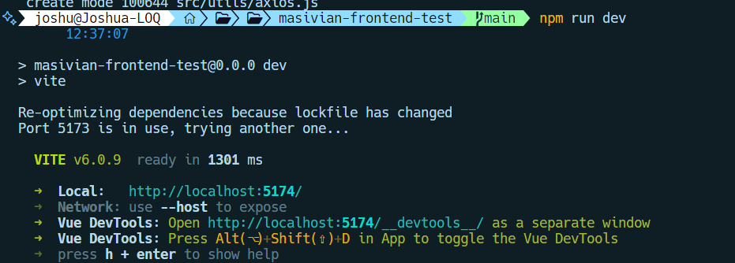

# masivian-frontend-test - Vue.js App

Este proyecto es una aplicacion sencilla construida con Vue que permite a los usuarios ver comics aleatoriamente mediante un boton, asi como calificarlos mediante un sistema de estrellas.

## Características

- Obtener un comic aleatorio de una API externa
- Calificar los comics usando un sistema de estrellas interactivo
- Se diseño una interfaz de usuario sencilla con un poco de CSS, SASS y Tailwind en su mayoria

---

## Requisitos previos

Antes de ejecutar la aplicación debe asegurrse de tener instalados los siguientes elementos:

- [Node.js](https://nodejs.org/en) (versión 18 o superior)
- [npm](https://www.npmjs.com/) (instalado junto con Node.js)

## Instalación

Debe seguir estos parsos para isntalar y ejecutar la aplicación:

1. **Clonar el repositorio**:

   ```bash
   git clone https://github.com/Dev-Joshua/masiv-frontend-test

   ```

2. Acceder al repositorio del proyecto:

   ```bash
   cd masiv-frontend-test

   ```

3. Instalar dependencias usando npm:
   ```bash
   npm install
   ```

---

## Ejecución de la aplicación

1. Iniciar el servidor de desarrollo usando npm:

   ```bash
   npm run dev

   ```

2. Abrir la aplicacion en el navegador, ir a la direccion o puerto configurado de su entorno:
   

## Estructura del proyecto

- src/components/: Contiene los componentes Vue de la prueba (ComicViewer y StarRating)
- src/assets/: Contiene los estilos Sass del componente App
- src/util/axios.js: Es el archivo de configuracion de Axios para realizar solicitudes HTTP a la API.
- src/main.js: Punto de entrada principal de la aplicacion

## Interactuando con la aplicacion

1. Para obtener un comic aleatorio desde la API se debe dar clic en el boton "Get Random Comic"
2. Se puede observar el titulo, numero del comic, año, imagen y descripcion como pie de pagina.
3. Utilice el sistema de estrellas al final del comic para calificar visualmente el comic.

## Tecologías utiizadas

- Vue.js 3 como framework para la construccion de la aplicacion
- Axios para manejo de solicitudes HTTP a la API
- Tailwind CSS como libreria para estilos mas personalizados y mayor flexibilidad
- CSS y SASS para algunos ajustes

## Recursos

- API de comics utilizada: https://xkcd.com/json.html
- Documentacion de Vue.js: https://vuejs.org/
- Documentacion de Tailwindcss: https://tailwindcss.com/

## Entregables

1. URL del repositorio que contiene el programa a la solucion de la prueba

   ```bash
   https://github.com/Dev-Joshua/masiv-frontend-test

   ```

2. Explicacion a las siguientes preguntas:

   - a. ¿Como construyó la solucion de la prueba?:

   1. Comence definiendo los requisitos principales de la prueba
   2. Opte por utilizar las tecnologias descritas en este documento, como vue por su facilidad para crear componentes reutilizables y su arquitectura. Asi como Tailwind para la personalizacion de los estilos y mayor flexibilidad a la hora de implementarlos en cada componente.
   3. Diseñe la solucion empezando por la estructura del proyecto, despues segui con la creacion de los componentes App, ComicViewer y por ultimo StarRating, para cada uno estructure el template mediante HTML, despues hice el diseño de la interfaz de usuario con tailwind, css y sass, por ultimo cree la logica para los componentes, primero implemente Axios para manejar las solicitudes hacia la API en el componente ComicViewer y luego implemente la logica en el componente StarRating para la calificacion del comic con estrellas.
   4. Se fueron guardando los cambios a medida del avance dentro del repositorio en GitHub utilizando como herramienta el sistema de control de versiones GIT.

   Para concluir dividi la aplicacion en dos componentes:

   - ComicViewer: Responsable de mostrar el comic y la informacion
   - StarRating: Componente que permite a usuario calificar cada comic de forma visual

- b. ¿Cuales fueron los principales problemas con los que se encontro?
  El principal desafio que encontre fue un error de CORS, porque el servidor de la API(xkcd.com) bloqueaba las solicitudes que se hicieran a esta API desde un origen diferente. Esto me tomo demasiado tiempo para encontrar el problema y dar con la solucion.

- c. ¿Como soluciono los problemas encontrados?
  Al final debugeando la consola del navegador encontre el error mas a detalle, vi varias soluciones en stackoverflow pero no me servian a la hora de implementarlas con vue. Con la ayuda de ChatGpt encontre la solucion para vue y pude entender que el error se debia a que el servidor no incluye un encabezado Access-Control-Allow-Origin en sus respuestas, lo cual bloquea las solicitudes desde un origen diferente.
  Para esto se tuvo que agregar un proxy para redirigir las solicitudes hacia el servidor y actualizar la URL base de mi ruta en el archivo axios.js.
